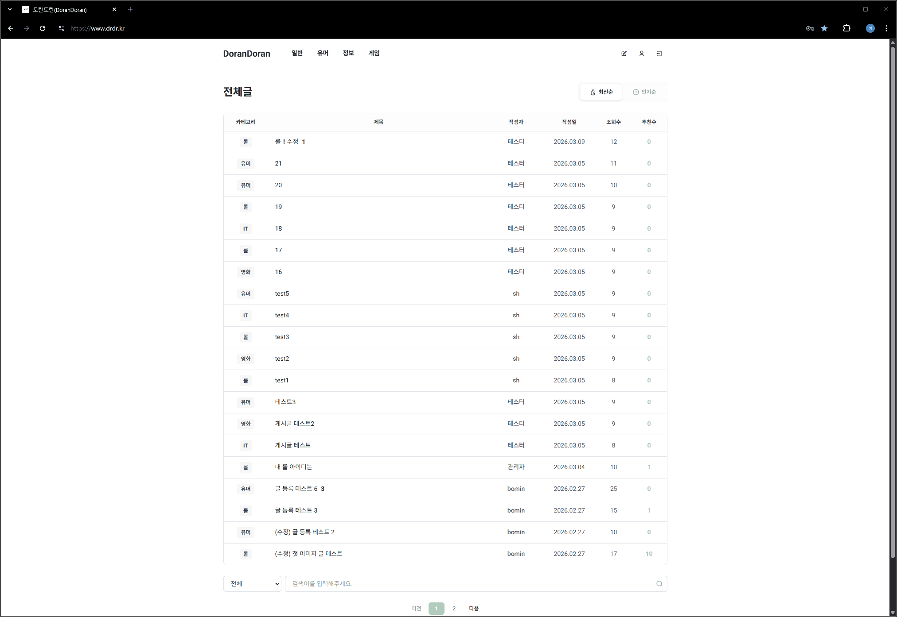
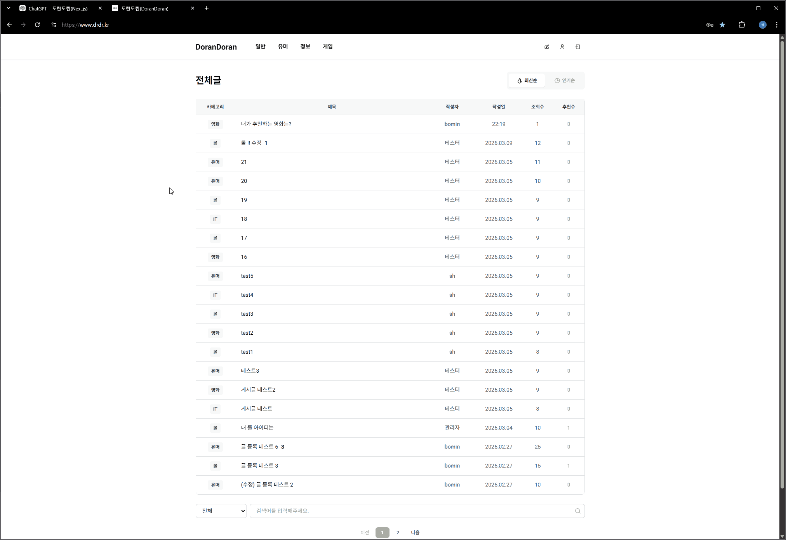
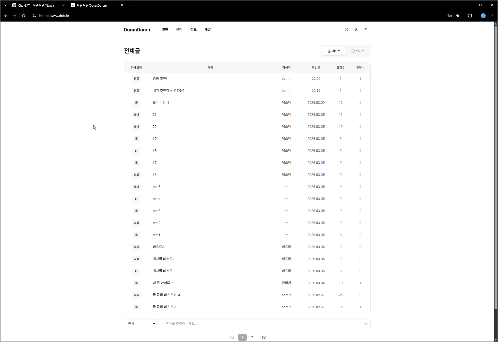
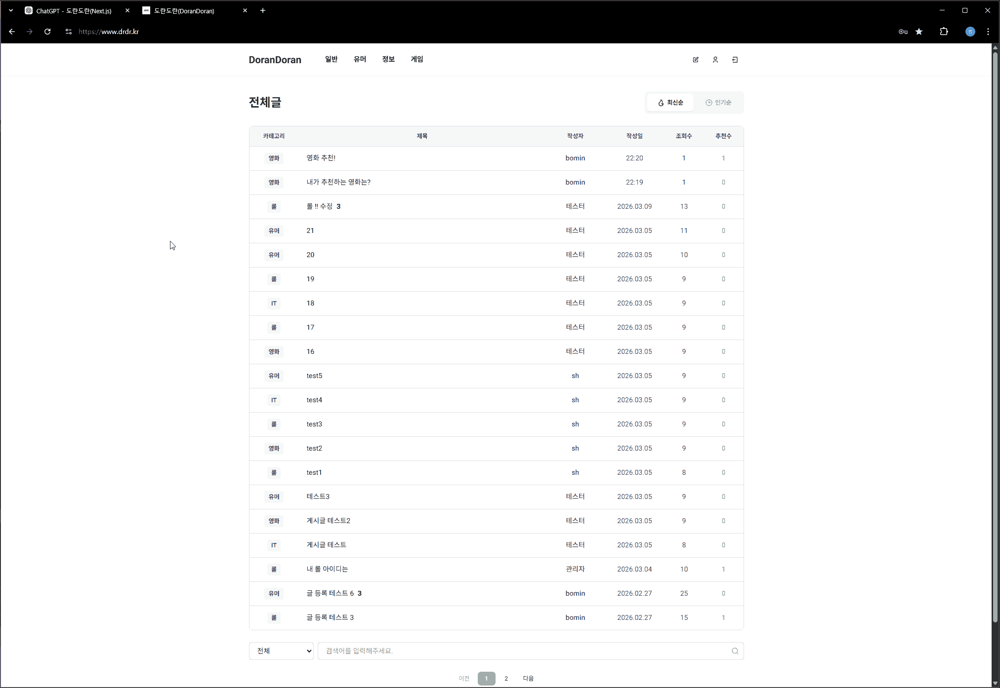

# Dorandoran

다양한 주제의 지식을 공유하고 소통할 수 있는 커뮤니티 서비스입니다.

# 테스트 계정

이메일 인증 기반 회원가입 서비스이나,
AWS 이메일 인증 서비스의 인증을 받지 못한 관계로,
DM 로 직접 만든 테스트 ID로 테스트 부탁드립니다.

### 일반 계정

- ID : tester
- PW : test!1234

### 어드민 계정

- ID : admin
- PW : drdr!1234

🔗 배포  
https://drdr.kr

🔗 Frontend Repository  
https://github.com/DRDR-ProjectGroup/frontend

---

# 서비스 미리보기

### 메인 페이지



### 게시글 작성



### 댓글 기능



### 쪽지 기능



---

# 프로젝트 소개

Dorandoran은 누구나 글을 조회하고,
이메일 인증 기반으로 회원가입을 하여 글을 작성하고,  
다른 사용자들과 소통할 수 있는 커뮤니티 서비스입니다.

사용자는 게시글 작성, 댓글, 쪽지 기능을 통해 소통할 수 있으며  
관리자는 관리자 페이지에서 카테고리 및 회원을 관리할 수 있습니다.

---

# 기술 스택

### Frontend

Next.js  
→ SEO 대응 및 서버 렌더링을 고려하여 선택

React  
→ 컴포넌트 기반 UI 개발

TypeScript  
→ 타입 안정성을 확보하기 위해 사용

TanStack Query  
→ 서버 상태 관리 및 캐싱 처리

Zustand
→ 전역 상태 관리

Tiptap Editor  
→ 게시글 작성 시 리치 텍스트 에디터 구현

---

### Backend

Spring Boot  
MySQL

---

### Infra

AWS S3  
→ 이미지 파일 저장

Vercel  
→ 프론트엔드 배포

---

# 주요 기능

## 게시글 작성

- Tiptap 기반 리치 텍스트 에디터 사용
- 이미지, 동영상, 유튜브 iframe 업로드 지원

---

## 게시글 수정

- 기존 이미지 유지
- 신규 이미지 추가 가능

---

## 댓글 및 대댓글

- 댓글 작성
- 대댓글 작성

---

## 회원 간 쪽지 기능

- 다른 회원에게 쪽지 전송
- 받은 쪽지 / 보낸 쪽지 확인

---

## 관리자 페이지

관리자는 관리자 페이지에서 다음 기능을 관리할 수 있습니다.

- 카테고리 생성 / 수정 / 삭제
- 회원 관리

---

# 프로젝트 구조

```
├ app # Next.js App Router 기반 페이지 및 레이아웃
├ components # 재사용 가능한 UI 컴포넌트
├ actions # 서버 액션 및 API 요청 로직
├ hooks # 커스텀 React Hooks
├ query # React Query 관련 로직
├ lib # 공통 유틸리티 및 헬퍼 함수
├ types # TypeScript 타입 정의
├ public # 정적 파일 (이미지, 아이콘 등)
```

컴포넌트, 데이터 요청 로직, 상태 관리 로직을 분리하여  
유지보수성과 확장성을 고려한 구조로 설계했습니다.

컴포넌트, hooks, API 로직을 분리하여  
유지보수성을 고려한 구조로 설계했습니다.

---

# 기술적 문제 해결

## 게시글 수정 시 이미지 처리 구조 개선

### 문제

기존 글 수정 시 모든 이미지를 삭제 후  
다시 업로드하는 방식이었습니다.

이 방식은

- 불필요한 파일 업로드 발생
- 서버 작업 증가

문제가 있었습니다.

### 해결

다음과 같은 방식으로 구조를 개선했습니다.

- 기존 이미지는 `mediaId` 유지
- 신규 이미지만 업로드
- 삭제된 이미지만 서버에서 제거

### 결과

불필요한 업로드를 제거하여  
서버 작업을 줄일 수 있었습니다.

---

## Next.js 데이터 패칭 전략 고민 (SSR vs React Query)

### 문제

프로젝트 초기에 Next.js App Router에 대한 이해가 부족하여  
데이터 요청은 **Server Component에서 `fetch`를 사용하는 방식**으로 구현했습니다.

하지만 이 방식은 다음과 같은 문제가 있었습니다.

- 클라이언트 인터랙션이 많은 페이지에서 상태 관리가 어려움
- 로딩 / 에러 / 캐싱 상태를 직접 관리해야 함
- 동일한 데이터를 여러 컴포넌트에서 사용할 때 재요청 발생

또한 Next.js에서는 SSR을 활용하면 SEO에 유리하다는 장점이 있어  
**SSR과 클라이언트 데이터 관리 방식 사이에서 고민이 있었습니다.**

---

### 고민

Next.js에서는 다음 두 가지 방식이 모두 가능했습니다.

**Server Component fetch**

장점

- 서버에서 HTML 생성 가능
- SEO 대응에 유리

단점

- 클라이언트 상태 관리가 어려움
- 캐싱 및 refetch 로직 직접 구현 필요

---

**React Query**

장점

- 서버 상태 관리 자동화
- 로딩 / 에러 / 캐싱 상태 제공
- 자동 refetch

단점

- 클라이언트 중심 데이터 처리
- SEO가 필요한 페이지에는 부적합할 수 있음

---

### 해결

각 기술의 장점을 살려 **데이터 패칭 전략을 분리했습니다.**

- **SEO가 필요한 페이지**
  → Server Component `fetch` 사용

- **클라이언트 인터랙션이 많은 기능**
  → React Query 사용

예시

- 게시글 상세 페이지 → SSR 기반 fetch
- 댓글 / 쪽지 / 사용자 인터랙션 → React Query

---

### 결과

이 방식을 통해

- SEO가 필요한 페이지는 SSR 활용
- 클라이언트 인터랙션은 React Query로 관리

하도록 역할을 분리하여  
Next.js 환경에서 효율적인 데이터 패칭 구조를 구성할 수 있었습니다.

### 느낀 바

Server Component 기반 데이터 패칭은 `revalidateTag` 이후 `router.refresh()`와 같은 트리거를 통해 RSC 트리를 다시 요청해야 UI가 갱신됩니다.

반면 React Query는 클라이언트 캐시를 기반으로 데이터를 구독하기 때문에
`invalidateQueries`만으로도 부분적인 데이터 갱신이 가능합니다.

---

# 개선 예정

- 모바일 반응형 UI
- 다크 모드
- 일부 페이지 SSR 전환

---

# 회고

이 프로젝트를 통해

- 이미지 업로드 처리
- 서버 상태 관리
- SEO 대응

등 다양한 프론트엔드 문제를 경험하고 해결할 수 있었습니다.
